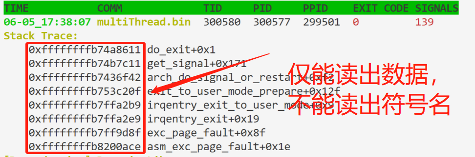
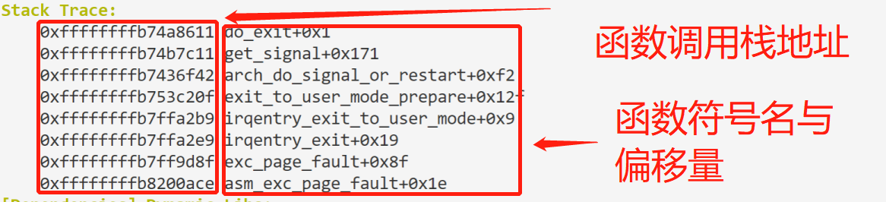
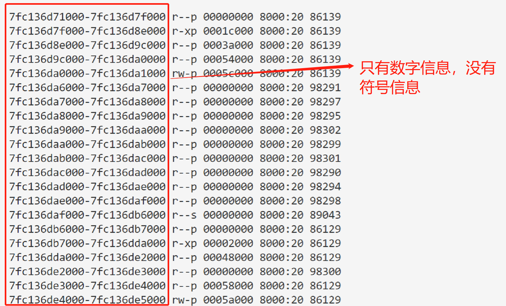
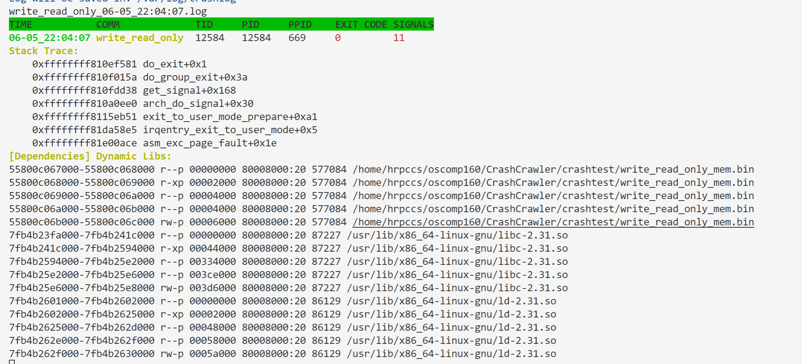
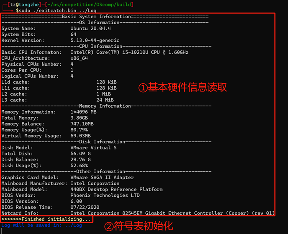
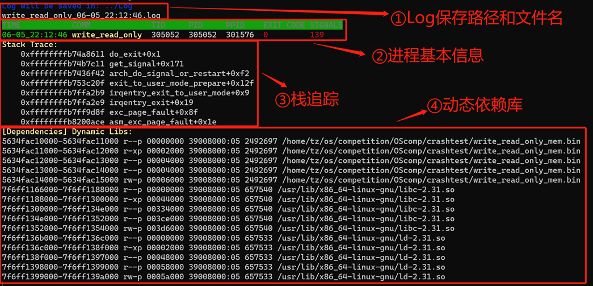
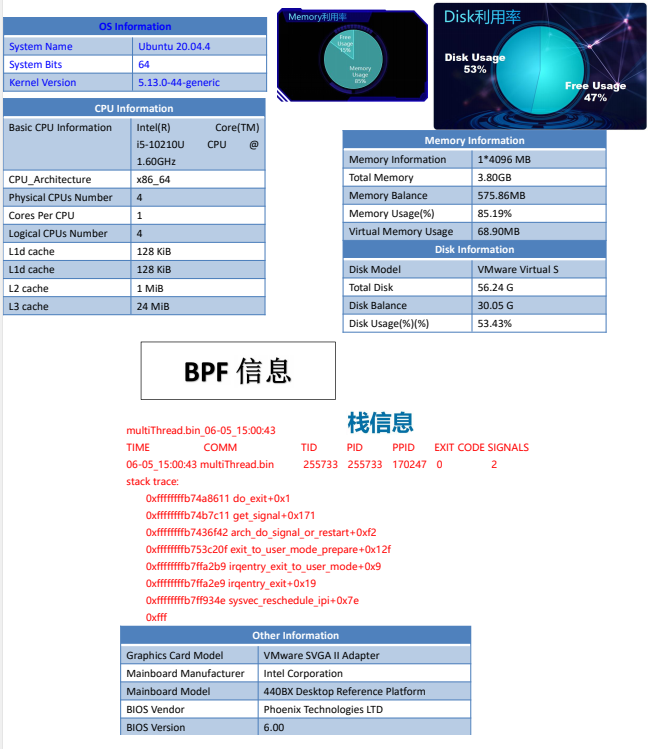

# SYSU-160 CrashCrawler开发文档

## 成员信息

**学校：中山大学**

**学院：计算机学院**

**专业：计算机科学与技术**

| 姓名  | 年级  | 邮箱                         |
| --- | --- | -------------------------- |
| 付恒宇 | 大二  | 2941845883@qq.com          |
| 洪瑞鹏 | 大二  | hrpccs@foxmail.com         |
| 唐喆  | 大二  | tangzh33@mail2.sysu.edu.cn |

## 一、项目开发进度

我们需要实现一个崩溃收集组件，可以追踪拦截到系统内的进程崩溃瞬间，在进程资源被操作系统回收前获取到进程的重要信息，为开发者找出问题所在提供信息支持。

下面是我们组件的开发进度，具体设计与实现原理请看项目设计与实现。

1. 正确拦截异常退出的进程。（初赛已完成）
   
   我们发现所有进程退出的最后，都会调用内核函数do_exit（），由操作系统回收进程资源等。我们通过Libbpf提供的封装，把eBPF程序挂载到do_exit（）的入口处，那么每个进程退出时都会触发已经加载到内核的eBPF程序，我们通过判断进程退出时的exitcode来判断是否应该收集该进程的信息并把它回传给用户态。

2. 在进程资源被回收前把进程的重要信息读取（与进程相关的由eBPF读取）
   
   - backtrace（已完成）：
     - （初赛）目前能够读取到崩溃进程的内核函数调用栈，并且通过内核符号表kallsyms得到对应的内核函数名与偏移量。
     - （**复赛**）目前可以读取到崩溃进程的**用户态调用栈**，并且通过nm，readelf指令获取崩溃进程相关的可执行文件（包括程序本身的elf可执行文件与动态链接库.so文件）的符号表，进而获取到跳转地址相应的函数名与偏移量。
   - 引发崩溃的信号（初赛已完成）：可以读取到进程执行do_exit（）内核函数时传入参数**exitcode**，在 进程异常退出时读取 exitcode的低7位，可以读到引发崩溃的信号。
   - 软件包版本与软件包依赖（初赛已完成）：目前可以在eBPF程序中通过模拟内核函数**d_path**的实现（用于读取出动态库的路径），能够读取到进程依赖的动态库依赖，但是无法获取该进程的一些静态编译的依赖（这些应该只有包管理器能够清楚，或者通过编译文件Makefile等，但是从我们崩溃收集组件的角度来说几乎无法获取）。
   - 硬件架构与操作系统版本信息（初赛已完成）：通过**lscpu**命令在我们的崩溃收集组件部署阶段就可以从部署机读取出来，这属于静态信息。
   - **更多的崩溃进程信息**（**复赛已完成**）：由procfs中的/proc/\<pid\>/stat启发，我们可以给出更多关于崩溃进程在崩溃前的状态信息。包括程序的工作集大小和限制（rss），调度策略，调度优先级，运行时间等等。

3. 分析收集到的崩溃信息，生成崩溃报告（完成）
   
   组件的用户态程序接收到eBPF从内核回传到用户态的崩溃进程信息后，可以把崩溃信息持久化保存在特定的路径。这部分信息主要是帮助开发者快速获取到引发该进程崩溃的信号，与相关的虚拟内存映射信息，还可以获取到程序在崩溃前的位于/proc/<\pid\>/stat的内容。
   

## 二、项目设计与实现

本项目实现的崩溃收集组件主要由两部分构成。第一部分也是最关键的部分是**崩溃进程的拦截与信息收集**，第二部分就是**持久化保存崩溃信息与崩溃报告生成**部分。

### 1. 崩溃进程拦截与信息收集

#### 设计思路与方案选取

我们需要在任何进程发生崩溃的时候，能够在操作系统把进程资源回收之前，把进程的与崩溃有关的信息保存下来。这就对我们的崩溃进程拦截手段有个硬性要求——必须是**触发式地拦截**。

我们通过搜集资料发现操作系统为我们提供了两个机制，分别是core dump机制与内核追踪机制。

##### **a. core dump机制**（不采用）

Linux提供的core dump机制是一种静态的进程状态收集机制，它在用户手动地通过ulimit设置core文件大小限制（默认大小为0，即不生成core dump文件），但是由于这样手动设置只对当前shell且由该shell启动地进程有效，所以对于其它终端启动的程序，还是默认无法产生core文件。

**结论**：**core dump机制**并不适合拦截整个操作系统层面的所有的进程是否发生崩溃并获取信息，比如对于开启core dump机制前启动的进程，是无法有效拦截的。它更适合某个用户在debug某个特定程序时提供内存镜像来协助调试工具进行debug。

##### b. 内核追踪机制（采用）

这些年来Linux系统越来越注重内核追踪问题。Linux操作系统为我们提供了tracepoint，kprobe，uprobe等机制。并且也有ftrace，perf等工具可以提供内核追踪的封装好的工具。

使用这些工具有很多方法：

最朴素的方法就是用命令行通过ftrace或者perf与debugfs交互，从debugfs里面读出所需信息。这个方法可以由于是在用户态，获取的信息时较为固定的，比较有限，可能无法收集到足够有用的信息。所以我们可以尝试进入到内核态去获取信息。

我们可以通过LKM或者是eBPF来进入内核态获取信息。

但是LKM和eBPF各有优势和缺点，下面是他们的对比，来自[[1]]()

| 维度                  | Linux 内核模块          | eBPF                         |
| ------------------- | ------------------- | ---------------------------- |
| kprobes/tracepoints | 支持                  | 支持                           |
| **安全性**             | 可能引入安全漏洞或导致内核 Panic | 通过验证器进行检查，可以保障内核安全           |
| 内核函数                | 可以调用内核函数            | 只能通过 BPF Helper 函数调用         |
| 编译性                 | 需要编译内核              | 不需要编译内核，引入头文件即可              |
| 运行                  | 基于相同内核运行            | 基于稳定 ABI 的 BPF 程序可以编译一次，各处运行 |
| 与应用程序交互             | 打印日志或文件             | 通过 perf_event 或 map 结构       |
| 数据结构丰富性             | 一般                  | 丰富                           |
| **入门门槛**            | 高                   | 低                            |
| **升级**              | 需要卸载和加载，可能导致处理流程中断  | 原子替换升级，不会造成处理流程中断            |
| 内核内置                | 视情况而定               | 内核内置支持                       |

但是eBPF也存在限制：

eBPF为了提供安全性而牺牲了很多灵活性，比如BPF代码逻辑比较简单，只支持有界循环。（较低内核版本存在指令数限制，堆栈大小存在限制等）。

由上述eBPF和LKM的比较与eBPF的限制，我们和指导老师讨论过后得出**结论**：采用eBPF来拦截和获取崩溃进程的信息，在eBPF的限制下我们仍然可以很好的读取到崩溃进程的重要信息。

##### eBPF挂载点的选取

eBPF实现的原理就是利用tracepoint和kprobe的形成的挂载点，在挂载点被触发时可以跳转到我们的eBPF程序上执行，从而获取在挂载点触发时保存的目标崩溃进程的内核信息。

对于我们想要监控的do_exit（）函数，我们找到了几个可供检测的点。

- sched_process_exit (tracepoint) ,是在do_exit()函数内部静态插入的监测点。在do_exit函数运行到静态插入点时触发。

- do_exit (kprobe)，在/sys/kernel/debug/tracing/available_filter_functions里可以找到do_exit说明这是我们可以用kprobe检测的函数，在进入do_exit函数时触发。

- sys_enter_exit(tracepoint)，是进入sys_exit系统调用（是对do_exit()函数封装的系统调用接口），可以在进入sys_exit系统调用时触发

挂载点的选取主要考虑：

1. 能否在所有进程退出时都触发。

2. 能否在触发时，我们想要读取的进程信息对应得进程资源还没有被操作系统释放。

综合考虑下选取了利用kprobe机制来追踪do_exit()。

不选其他两个的原因如下：

sched_process_exit在do_exit()内核源码里面插入的地方在exit_mm函数（释放进程占有内存的函数）的后面，所以没办法读取进程所拥有内存里面的一些信息。

sys_enter_exit则是在用户态执行sys_exit系统调用时才会触发，但是很多进程退出不是显式地调用该系统调用，所以不太适合本场景，经测试也发现这个挂载点和kprobe的do_exit入口处的挂载点触发条件不同。

##### 进程信息的收集

首先通过分析do_exit的传入参数exitcode来初步判断本进程是否是异常退出。通过exitcode的高8位是否为0可以判断该进程是否是通过return来退出进程的，高8位为0并且exitcode整体不为0的话说明是异常退出。

对于异常退出的进程，我们利用eBPF提供的BPF_MAP_TYPE_RINGBUF类MAP和BPF_MAP_TYPE_STACK_TRACE类MAP来把信息传给用户态。在eBPF程序中利用libbpf提供的bpf_helper函数，可以读取崩溃进程的task_struct结构体（PCB/TCB）里面的信息，基本上该进程的所有信息都可以从该结构体里面读取出来。

对于回传给用户态的信息，我们用一个结构体组织起来。

```c
//exitcatch.h
struct mmap_struct{
    unsigned long start; //内存映射起始地址
    unsigned long end;   //内存映射终止地址
    unsigned long flags; //权限
    unsigned long long pgoff;    //页偏移
    unsigned long ino;    //内存映射对应的inode
    dev_t dev;            //内存映射对应的设备号
    char name[MAX_LEVEL][MAXLEN_VMA_NAME+1];    //内存映射对应的文件的绝对路径
};

struct event{
        pid_t pid;    //进程id信息
        pid_t tid;
        pid_t ppid;
        int sig;        //进程终止信号
        int exit_code;    //进程退出码
        char comm[TASK_COMM_LEN]; //进程对应的命令
        unsigned long stack_id;    //对应的stacktrace map里面的索引
        unsigned long count;        //内存映射的计数
        struct mmap_struct mmap[MAX_VMA_ENTRY]; //记录内存映射
};
```

最后在用户态通过读取ringbuffer传递的event结构体，我们就可以把崩溃进程的信息读取到用户态了，并且可以持久化存储下来。

```c
//exitcatch.c/main
rb = ring_buffer__new(bpf_map__fd(skel->maps.rb), handle_event, NULL, NULL);
// 周期性地从ring_buffer里面读取event
while (!exiting)
    {
        err = ring_buffer__poll(rb, 100 /* timeout, ms */);
        /* Ctrl-C will cause -EINTR */
        /* ... */
    }
```

event事件处理函数**handle_event**（**void *ctx, void *data, size_t data_sz**）就是把读取到的进程信息转储到指定路径的log文件中。

以上就是崩溃进程收集模块的设计思路了，具体实现主要是eBPF程序，具体实现可以看`exitcatch.c` 的主函数和事件处理函数以及`exitcatch.bpf.c`里的BPF程序。

以上就是第一部分崩溃进程拦截与信息收集的模块。

### 2. 崩溃报告生成与持久化保存崩溃信息

#### 崩溃报告

对于崩溃报告，我们的理解是：我们收集内核中崩溃信息，操作环境基本信息（OS概况，硬件参数等），将其整理后以一种结构化的易读形式展现给使用者，这种结构化的信息汇总本身就是一份报告，其中信息已经显示展现了线程崩溃的原因。在未来，我们还将细化工作，通过读取进程地址空间中的内存映射段来分析是否内存泄漏等，这将在创新点中详细介绍。

崩溃报告具体效果如下：

###### 系统概况

在软件初始化阶段，我们会读取系统概况，如：操作系统基本信息，CPU、主存、硬盘和其他硬件信息等。

```
=====================Basic System Information===========================
---------------------------OS Information-------------------------------
System Name:            Ubuntu 20.04.4
System Bits:            64
Kernel Version:         5.13.0-44-generic
---------------------------CPU Information-------------------------------
Basic CPU Informaton:   Intel(R) Core(TM) i5-10210U CPU @ 1.60GHz
CPU_Architecture:       x86_64
Physical CPUs Number:   4
Cores Per CPU:          1
Logical CPUs Number:    4
L1d cache:                       128 KiB
L1i cache:                       128 KiB
L2 cache:                        1 MiB
L3 cache:                        24 MiB
---------------------------Memory Information----------------------------
Memory Information:     1*4096 MB
Total Memory:           3.80GB
Memory Balance:         753.01MB
Memory Usage(%):        80.64%
Virtual Memory Usage:   71.99MB
---------------------------Disk Information------------------------------
Disk Model:             VMware Virtual S
Totol Disk:             56.49 G
Disk Balance:           29.75 G
Disk Usage(%):          52.67%
--------------------------Other Information------------------------------
Graphics Card Model:    VMware SVGA II Adapter
Mainboard Manufacturer: Intel Corporation
Mainboard Model:        440BX Desktop Reference Platform
BIOS Vendor:            Phoenix Technologies LTD
BIOS Version:           6.00
BIOS Release Time:      07/22/2020
Netcard Info:           Intel Corporation 82545EM Gigabit Ethernet Controller (Copper) (rev 01)
```

###### 崩溃信息收集

软件初始化完成后，我们将收集非正常退出进程的信息，如：崩溃时间，崩溃指令，崩溃进程信号等基本信息，以及崩溃进程的**栈追踪**和线程的**动态依赖库**。在组织文件输出格式是，我们参考了Linux中信息展现形式，如动态依赖库信息展示格式类似于`/proc/<pid>/maps`的格式与内容，旨在让使用者快速熟悉信息内容。

```
multiThread.bin_06-05_20:25:08.log
TIME           COMM             TID     PID     PPID    EXIT CODE SIGNALS
06-05_20:25:08 multiThread.bin  303242  303240  301576  0         11
Stack Trace:
    0xffffffffb74a8611 do_exit+0x1
    0xffffffffb74b7c11 get_signal+0x171
    0xffffffffb7436f42 arch_do_signal_or_restart+0xf2
    0xffffffffb753c20f exit_to_user_mode_prepare+0x12f
    0xffffffffb7ffa2b9 irqentry_exit_to_user_mode+0x9
    0xffffffffb7ffa2e9 irqentry_exit+0x19
    0xffffffffb7ff934e sysvec_reschedule_ipi+0x7e
    0xffffffffb8200dc2 asm_sysvec_reschedule_ipi+0x12
[Dependencies] Dynamic Libs:
560ff7a19000-560ff7a1a000 r--p 00000000 39008000:05 2505103 /home/tz/os/competition/OScomp/crashtest/multiThread.bin
560ff7a1a000-560ff7a1b000 r-xp 00002000 39008000:05 2505103 /home/tz/os/competition/OScomp/crashtest/multiThread.bin
560ff7a1b000-560ff7a1c000 r--p 00004000 39008000:05 2505103 /home/tz/os/competition/OScomp/crashtest/multiThread.bin
560ff7a1c000-560ff7a1d000 r--p 00004000 39008000:05 2505103 /home/tz/os/competition/OScomp/crashtest/multiThread.bin
560ff7a1d000-560ff7a1e000 rw-p 00006000 39008000:05 2505103 /home/tz/os/competition/OScomp/crashtest/multiThread.bin
7f74b4c76000-7f74b4c7c000 r--p 00000000 39008000:05 657553 /usr/lib/x86_64-linux-gnu/libpthread-2.31.so
7f74b4c7c000-7f74b4c8d000 r-xp 0000c000 39008000:05 657553 /usr/lib/x86_64-linux-gnu/libpthread-2.31.so
7f74b4c8d000-7f74b4c93000 r--p 0002e000 39008000:05 657553 /usr/lib/x86_64-linux-gnu/libpthread-2.31.so
7f74b4c93000-7f74b4c94000 r--p 00038000 39008000:05 657553 /usr/lib/x86_64-linux-gnu/libpthread-2.31.so
7f74b4c94000-7f74b4c95000 rw-p 0003a000 39008000:05 657553 /usr/lib/x86_64-linux-gnu/libpthread-2.31.so
7f74b4c99000-7f74b4c9a000 r--p 00000000 39008000:05 657541 /usr/lib/x86_64-linux-gnu/libdl-2.31.so
7f74b4c9a000-7f74b4c9c000 r-xp 00002000 39008000:05 657541 /usr/lib/x86_64-linux-gnu/libdl-2.31.so
7f74b4c9c000-7f74b4c9d000 r--p 00006000 39008000:05 657541 /usr/lib/x86_64-linux-gnu/libdl-2.31.so
7f74b4c9d000-7f74b4c9e000 r--p 00006000 39008000:05 657541 /usr/lib/x86_64-linux-gnu/libdl-2.31.so
7f74b4c9e000-7f74b4c9f000 rw-p 00008000 39008000:05 657541 /usr/lib/x86_64-linux-gnu/libdl-2.31.so
7f74b4c9f000-7f74b4cc1000 r--p 00000000 39008000:05 657540 /usr/lib/x86_64-linux-gnu/libc-2.31.so
7f74b4cc1000-7f74b4e39000 r-xp 00044000 39008000:05 657540 /usr/lib/x86_64-linux-gnu/libc-2.31.so
7f74b4e39000-7f74b4e87000 r--p 00334000 39008000:05 657540 /usr/lib/x86_64-linux-gnu/libc-2.31.so
7f74b4e87000-7f74b4e8b000 r--p 003ce000 39008000:05 657540 /usr/lib/x86_64-linux-gnu/libc-2.31.so
7f74b4e8b000-7f74b4e8d000 rw-p 003d6000 39008000:05 657540 /usr/lib/x86_64-linux-gnu/libc-2.31.so
```

#### 持久化保存崩溃信息

对于持久化保存崩溃信息，我们的解决方案是：将以上终端打印出来的信息，同时存入一份副本到**自定义**的`Log`文件夹中；文件名是`崩溃原因+崩溃时间.log`，文件内容即上文介绍的崩溃报告。

#### 持久化保存崩溃信息

这部分简单的用`fprintf`函数写入到指定路径下的用崩溃进程信息命名的log文件中。其中动态链接库部分仿照`/proc/<pid>/maps`的格式与内容。

## 三、遇到的困难和解决办法

1.无法打印出内核函数名：尽管我们通过eBPF提供的函数和Map等机制将崩溃进程栈信息从内核态中了出来，并按一定的格式输出：



        以上截图是我们完成版程序的截图。可以看到，一开始我们仅能读出64位的函数调用栈地址，但其符号含义是我们不能解析的，无法用于分析。经查阅资料，我们发现在内核编译完成时会将内核符号表保存在`/proc/kallsyms`中。但内核符号表符号名的地址，与我们的函数调用栈地址并不是一一对应，所以不能简单的使用键值对的方法来存储。在经过思考后，我们通过以下步骤打印出了符号名和偏移量：①在程序初始化时将`/proc/kallsyms`读入内存；②借助**基于二分搜索LowerBound算法**来搜索O(log_2n)符号名。最终，我们的实现结果如下：



2.无法在ebpf中使用循环：

        尽管eBPF十分强大，但其仍为了安全做了不少限制。其中，显著影响我们的限制即不允许我们在eBPF中使用循环。无法使用循环本质上是无法*任意*使用循环，eBPF的安全验证需要保证载入内核的代码无死循环片段，但我们仍是能使用**有界循环**的。在编译器的帮助下，我们使用**有界循环+循环展开的方式**，如`#pragma unroll`等编译制导语句引导编译器循环展开，从而在eBPF程序中使用循环。使用循环解锁了我们在内核中探查信息的能力（比如遍历链表），从而帮助我们完善程序功能。

3.无法解析动态库路径名：

        在读进程动态依赖库时，我们遇到了类似第一点的困难。eBPF在挂载点读出的信息仅仅是数字构成的内存地址，并无符号名：



但不同的是，这次没有内核符号表供我们搜索。受`/proc/<pid>/maps`下实现机制的启发，我们通过读进程结构体`task_struct` 中的 `mm_struct`里面管理虚拟内存映射的链表`vm_area_struct*` 即`task->mm->mmap`。对于虚拟内存映射链表的每一项`vm_area_struct`都代表了该进程地址空间的一段，通过循环读取链表，我们可以从中读出所有映射到进程地址空间中的动态库。

其中最困难的就是读取动态库对应的在文件系统里的绝对路径，这里也通过`vm_area_struct`里的`vm_file`字段得到代表路径的结构体`struct path`即`vm_area_struct->vm_file->f_path`。我们需要从中读取出动态库的绝对路径，但是内核中完成该任务的内核函数`d_path()`我们没法用，libbpf库提供的helper函数`bpf_d_path`也与我们的tracing类eBPF程序不兼容。

所以最后只能仿照内核源码，通过固定次数的迭代来读取动态库的路径。最终得到如图效果：



4. 无法解析用户函数名：
    
    复赛期间，我们希望获取崩溃进程在触发崩溃瞬间的用户态调用栈，通过libbpf提供的`bpf_get_stackid`辅助函数，我们可以容易地获取到用户态调用栈里的64位跳转地址。但是我们必须要得到这些虚拟地址对应的函数名（符号名）才对开发人员有实际意义。

    于是就出现了**该如何解析用户空间虚拟地址获取相应符号名**的问题。一开始我们没有很多头绪，于是我们转而查询一般的程序是如何获取自己的用户态调用栈的。然后我们发现：
    -   对于基于虚拟机的程序，比如java程序和python程序。由于虚拟机本身为它们记录了和组织了函数调用追踪，所以非常容易就可以获取到某一时刻的函数调用栈。
    -   对于大多数linux系统程序获取自己的调用栈都是通过一组函数：`backtrace() backtrace_symbols()`还有`addr2line()`,来实现打印用户态的调用栈。

    我们觉得第一种方法也许涉及到jvm或者python的虚拟机的内部机制，难以在linux操作系统提供的接口基础上直接复现，所以我们想能否挖掘glibc提供的通过用户虚拟地址获取相应符号名的函数`backtrace_symbols()`的实现机制，然后通过直接调用或者移植到我们的bpf用户侧程序以达到通过用户虚拟空间的地址获取相应具体函数符号的目的。

    但是我们通过阅读glibc关于[该函数的源码](https://github.com/bminor/glibc/blob/master/debug/backtracesyms.c)发现`backtrace_symbols`的实现需要借助调用该程序本身的elf文件信息。对于**程序自己调用`backtrace_symbols`来获取自身符号信息的情况下**，这种方法是方便的。因为我们在阅读该函数的实现时，发现它需要借助进程内存存储着属于`libld.so`动态库的关于elf链接与加载的数据，来达到解析符号的目的。

    但是，对于我们的崩溃收集组件，在进程崩溃后进程资源已经被释放，我们在用户侧bpf程序是无法获取内存中关于崩溃进程elf加载的信息的。所以我们需要另辟蹊径。

5. eBPF限制了获取内核信息的数量：

    在解析用户函数调用栈对应的用户函数名时，有时候会找不到跳转地址对应的符号，原因就是我们有时候会遇到一些无法完全遍历vm_area_struct链表的情况。经过分析，出现这种情况的原因主要有两点：
    
    - 一是循环体内分支多，并且循环次数多，导致`verifier`需要模拟的状态过多，进而加载程序失败。在加载eBPF程序进入内核时，需要经过验证eBPF程序可靠性的`verifier`的检验，它会模拟eBPF的运行，如果循环体中存在分支，那么在循环层数增多的同时，`verifier`需要处理分支过多的时候，它会加载eBPF程序失败。对于这种情况，我们摸索出了一种解决方法，就是减少循环体内的分支判断。简单来说就是，我们正常写用户态程序，在通过指针遍历链表时，需要对指针进行判空处理，否则容易出现`segment fault`。但是在写eBPF内核部分程序时，我们可以改变思路。因为我们不通过直接对指针解引用，而是通过`bpf_helper_function`来间接地读指针指向的内容，它本身就存在了保护机制，所以我们可以减少分支判断，从而`达到增大遍历链表深度的目的`。

    - 二是**eBPF程序的指令数存在一百万条的限制**，在解决了上一个问题后，我们进一步增加了遍历链表的深度，但是由于eBPF本身确实不支持循环，我们需要借助编译器将循环展开，这就导致循环次数越多，eBPF程序的指令数越多。要解决这个限制，存在两种方案：
        
        - 最简单的一种是简化循环内逻辑，换句话就是少收集一些信息，只收集关键信息，这样可以把有限的指令数给到更关键的地方，比如增加循环次数。（能用的指令数最多一百万条）

        - 另一种方法就是借助`libbpf`提供的`bpf_tail_call()`辅助函数，它的作用就是保留当前eBPF程序的栈帧，但是跳转到另一个eBPF程序执行（永远不会返回）。它提出的一个目的就是突破eBPF的指令限制。要借助它来突破限制，我们有个方案就是把循环体内的代码拆成相互独立的几部分，然后每部分都单独放到一个eBPF程序里面，这样就可以达到拆分逻辑，从而达到进一步增加可用指令数的，进而增加循环次数的目的。（理论上我们可以用的指令数上限为 循环拆分的模块数 * 一百万）

    理论上讲，因为eBPF程序终究不是图灵完备的，所以在链表长度太长的时候，无论如何都无法完全读取完成。目前的代码已经可以应付大多数情况了，少数动态库数量太多，内存分布太复杂的程序没法完全得到所有动态库信息。
    

    

## 四、创新点

### 1. eBPF进行内核追踪

我们利用eBPF来收集崩溃进程信息，**优势**主要有：

- 安全，不会导致内核panic。在将eBPF与LKM进行对比时，我们可以看到eBPF牺牲了一些功能实现灵活性，只为eBPF程序开放了较少的和操作系统交互的接口（bpf_helper函数），也因此eBPF程序的行为总是在可以控制的范围内进行。

- 功能性强。通过task_struct结构体，我们可以利用bpf_probe_read_kernel这些bpf_helper函数读取到进程甚至内核的几乎所有信息，比如我们目前从task_struct里面只读了动态库依赖的信息，其实我们还可以读出所有在`/proc/<pid>/maps`里的信息，但是需要更多的代码逻辑。

- 是**触发式**的，操作系统全局的进程都可以触发，并且能够看到该进程崩溃瞬间所有的信息。我们通过eBPF程序在进程崩溃资源被回收前，在内核态直接读取进程的数据。这时候进程会在我们的eBPF程序结束后才会被回收资源，所以我们得到的信息就是进程崩溃瞬间的信息。这相较于我们在用户态利用**周期扫描式**的执行`ldd,cat /proc/<pid>/maps,strace`等指令，显然在获取进程信息上更便利与准确、也不会发生因为扫描周期不够小，导致无法追踪一些**刚创建就崩溃**的进程、更不会出现周期扫描导致的资源浪费。

- 并且由于是触发式的，所以比coredump更为灵活，因为对于一些启用core dump机制前就创建好的进程，core dump是无法拦截到它的。

### 2.灵活解决eBPF带来的问题

尽管eBPF程序在代码实现上不太灵活，但是总是有办法通过bpf_helper来实现目的，只不过较为麻烦。但是比如我要通过遍历链表来获取该进程所有的内存映射段的信息和在tracing类eBPF程序里面获取一个文件的绝对路径，尽管我们没有现有的bpf_helper函数来辅助完成。但是我们可以仿照该部分的内核源码，利用eBPF来实现简化逻辑的版本。

这些简化逻辑版本的实现本质上是用**空间换取安全性**，比如遍历链表读取信息需要预留固定个数的固定长度的缓冲区，如果需要保证能够完全读取整个链表，那么预留的空间就要更多。比如遍历进程的虚拟内存映射段的链

## 五、效果展示

1.启动页面（组件部署阶段）



2.普通错误退出

signals=139=128 + 11说明是segmentation fault和触发了core dump



3.多线程崩溃


## 六、总结，收获与未来展望

**总结**

本项目已经完成了大部分内容了，最重要的进程拦截和信息收集完成度都非常高了，并且我们已经能够生成对程序员来说具有指示进程崩溃原因所在的崩溃报告。但是由于时间原因，我们预想中的一些功能还没有实现，没有实现的功能放到未来展望部分。

**收获**

我们本次参加操作系统比赛，目的主要是在竞赛中学习操作系统内核相关知识。在4月底报名以来，我们查阅了core dump和内核追踪机制的有关资料，最后决定用eBPF来实现本项目。在实现的过程中，我们主要有以下收获：

1. 在小规模的代码管理实践中，对git版本管理工具的使用更加熟练。

2. 在实现eBPF程序的时候，由于该技术比较新，遇到的很多问题都需要查阅英文资料和看linux内核commit的详情里面提交者的示例代码，才能解决，在这个过程中，英文资料的搜索与阅读都变得得心应手了。对eBPF这个比较新的技术的认识也更加深入，也逐渐入门了这个技术。

3. 在遇到没有bpf helper 函数帮助我们实现读取某个内核信息的功能时，我们只能通过阅读linux内核是如何实现这部分功能的，然后在eBPF程序里模拟出这个内核函数的简化版本。在这个简化的过程中，我们阅读了很多linux的内核代码，并且是读懂了里面的一些实现我们才能够把代码逻辑抽离出来，然后简化实现。我们阅读较大项目源码的能力也得到了提高。

4. 通过本次代码实现，我们对整个现代的操作系统的运行有了更深的了解，比如eBPF实现的机制原理，也比如庞大的linux内核代码在进程的眼中是怎么样的（从do_exit()这个函数的内部实现可以管中窥豹，对进程的整个生命周期中，各种资源是如何被管理的，有哪些数据结构在支撑这个精密的系统）。

**未来展望**

未来可以在现在的代码基础上实现的有：

1. 通过eBPF从内核读取更多的进程信息，比如所有的`/proc/<pid>/maps`的信息，这样可以通过虚拟内存的占用来分析出进程的内存泄漏问题等等。

2. 通过已有的崩溃进程信息，分析出可能存在的原因。目前的实现思路为用`switch case`代码逻辑从离散的已知信息中得到某些信号代表的含义，比如退出信号为11说明是segmentation fault，退出信号为9说明是Ctrl+C中断信号等，更进一步的话，可以分析valgrind的进程运行时内存行为的监控工具的原理来实现更有意义的崩溃分析。

3. 未来可以利用libbpf + CO-RE 进行多版本可移植分发。

4. 利用数据库存储进程崩溃信息，崩溃日志的管理更加方便，高效。

5. 把崩溃报告用可视化的形式展示出来，更方便开发者查看。比如下面这样


## 七、参考文献

**eBPF学习**

[1]    eBPF概念学习 https://www.ferrisellis.com/content/ebpf_past_present_future/

[2]    perf_event学习 https://www.cnblogs.com/pwl999/p/15535028.html

[3]    Linux man bpf（2）

[4]     Libbpf + CO:RE编程学习 https://github.com/DavadDi/bpf_study示例 和 https://facebookmicrosites.github.io/bpf/blog/2020/02/20/bcc-to-libbpf-howto-guide.html#field-accesses

[5]    libbpf 编程示例参考 https://github.com/iovisor/bcc/tree/master/libbpf-tools 

**数据分析依据**

[1]    Linux man signals (7)

[2]    exitcode 意义分析 https://www.linuxdoc.org/LDP/abs/html/exitcodes.html

[3]    进程异常退出分析 https://blog.csdn.net/challenglistic/article/details/123882574

**内核代码阅读**

[1]     d_path函数实现 https://code.woboq.org/linux/linux/fs/d_path.c.html#d_path

[2]    /proc/<pid>/maps 函数实现 [fs/proc/task_mmu.c - kernel/msm - Git at Google](https://android.googlesource.com/kernel/msm/+/android-lego-6.0.1_r0.2/fs/proc/task_mmu.c)

